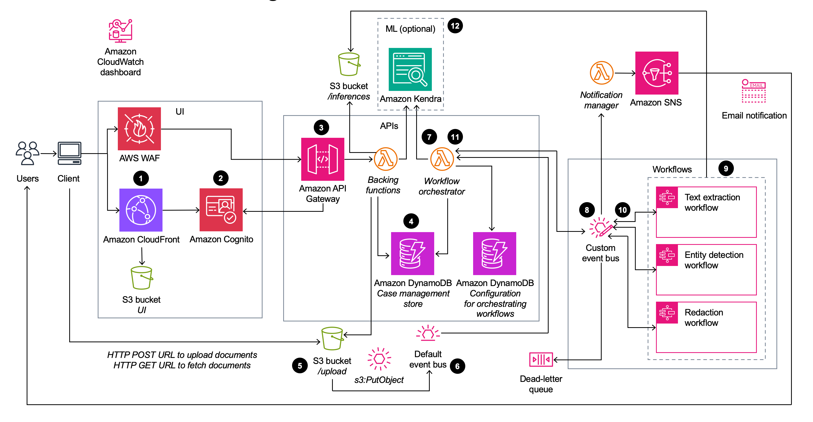

## Enhanced Document Understanding on AWS

Organizations across industries are increasingly required to process large volumes of semi-structured and unstructured documents with greater accuracy and speed. They need a document processing system that ingests and analyzes documents, extracts their content, identifies and redacts sensitive customer information, and creates search indexes from the analyzed data.
Many industries have stringent compliance requirements to redact personally identifiable information (PII) and protected health information (PHI) from documents. In most cases, organizations manually process documents to extract information and insights. This approach can be time consuming, expensive, and difficult to scale. Organizations need information to rapidly extract insights from documents. They can benefit from a smart document processing system as a foundation to automating business processes that rely on manual inputs and interventions. 
To help meet these needs, the Enhanced Document Understanding on AWS solution: 


- Automates document ingestion process to improve operational efficiency and reduce cost
- Ingests and analyzes document files at scale using artificial intelligence (AI) and machine learning (ML)
- Extracts text from documents
- Identifies structural data (such as single word, a line, a table, or individual cells within a table)
- Extracts critical information (such as entities)
- Creates smart search indexes from the data
- Detects and redacts PII and PHI to generate a redacted version of the original document


You can use each of these features standalone or configure the solution as a unique composition of workflow orchestration based on your use case.
This solution deploys an [AWS CloudFormation](https://aws.amazon.com/cloudformation/) template that provides the capability to configure workflows for various use cases. The solution allows users to define custom workflows that include the types of documents required for their workflows and the type of processing each document can be subjected to.
The solution also provides a web user interface (UI) for users to upload documents. Once the documents are uploaded, a backend workflow orchestrates AWS managed AI services to process documents at scale. 
For a detailed solution implementation guide, refer to [Enhanced Document Understanding on AWS](https://aws.amazon.com/solutions/implementations/enhanced-document-understanding-on-aws).

## On this page

- [Architecture Overview](#architecture-overview)
- [Deployment](#deployment)
- [Source code](#source-code)
- [Creating a custom build](#creating-a-custom-build)

## Architecture Overview

Deploying this solution with the default parameters deploys the following components in your AWS account.



The high-level process flow for the solution components deployed with the CloudFormation template is as follows:
1. The user requests the browser to navigate to an [Amazon CloudFront](https://aws.amazon.com/cloudfront/) URL.
2. The UI prompts the user for authentication, which the solution validates using [Amazon Cognito](https://aws.amazon.com/cognito/).
3. The UI interacts with the REST endpoint deployed on [Amazon API Gateway](https://aws.amazon.com/api-gateway/).
4. The user creates a case that the solution stores in the **Case management store** [Amazon DynamoDB](https://aws.amazon.com/dynamodb/) table.
5. The user requests a signed [Amazon Simple Storage Service](https://aws.amazon.com/s3/) (Amazon S3) URL to upload documents to an S3 bucket.
6. Amazon S3 generates an `s3:PutObject` event on the default [Amazon EventBridge](https://aws.amazon.com/eventbridge/) event bus.
7. The `s3:PutObject` event invokes the workflow orchestrator [AWS Lambda](https://aws.amazon.com/lambda/) function. This function uses the configuration stored in the **Configuration for orchestrating workflows** DynamoDB table to determine the workflows to be called.
8. The workflow orchestrator Lambda function creates an event and sends it to the custom event bus.
9. The custom event bus invokes one of the three [AWS Step Functions](https://aws.amazon.com/step-functions/) [state machine](https://docs.aws.amazon.com/step-functions/latest/dg/amazon-states-language-state-machine-structure.html) workflows based on the event definition.
10. The workflow completes and publishes an event to the custom EventBridge event bus.
11. The custom EventBridge event bus invokes the workflow orchestrator Lambda function. This function uses the configuration stored in the Configuration for orchestrating workflows DynamoDB table to determine whether the sequence is complete or if the sequence requires another workflow:
a. The solution updates the **Case management store** DynamoDB table.
b. If the sequence is not complete, the solution returns to step 8 for the next state machine workflow.
12. The workflow orchestrator Lambda function writes metadata from the processed information to an [Amazon Kendra](https://aws.amazon.com/kendra/) index. This index provides the ability to perform machine learning powered search. 

**Note: The deployment to Amazon Kendra is optional. If not deployed the search feature is not available.**


## Deployment

**Note: You can also test the UI project locally by deploying the API endpoints and the rest of the infrastructure. To do so, follow either of the below two options and then refer [UI](source/ui/README.md) project for
details.**

There are two options for deployment into your AWS account:

### 1. Using `cdk deploy`

Following are pre-requisites to build and deploy locally:

- [Nodejs 20.x](https://nodejs.org/en)
- [CDK v2.113.0](https://github.com/aws/aws-cdk)
- [Python 3.12](https://www.python.org/)
  - _Note: normal python installations should include support for `ensurepip` and `pip`; however, if running in an environment without these packages you will need to manually install them (e.g. a minimal docker image). See [pip's installation guide](https://pip.pypa.io/en/stable/installation/) for details._
- [Java 17](https://aws.amazon.com/corretto/)
- [Maven](https://maven.apache.org/)
- [AWS CLI](https://aws.amazon.com/cli/)

**Note: Configure the AWS CLI with your AWS credentials or have them exported in the CLI terminal environment. In case the credentials are invalid or expired, running `cdk deploy` produces an error.**

After cloning the repo from GitHub, complete the following steps:

```
  cd <project-directory>/source/infrastructure
  npm install
  npm run build
  cdk deploy
```

### 2. Using CloudFormation templates

To deploy CloudFormation templates, follow the instruction for [creating a custom build](#creating-a-custom-build).

## Source code

### Project directory structure

```
├── email-templates                   [email templates]
├── sample-documents                  [sample documents for different industry verticals]
├── images                            [images used for markdown files]
│   ├── architecture.png
│   └── ui-components.png
├── infrastructure                    [CDK infrastructure]
│   ├── bin
│   ├── cdk.json
│   ├── cdk.out
│   ├── coverage
│   ├── jest.config.js
│   ├── lib
│   ├── node_modules
│   ├── package-lock.json
│   ├── package.json
│   ├── test
│   └── tsconfig.json
├── Lambda                            [Lambda functions for the application]
│   ├── create-presigned-url
│   ├── custom-resource
│   ├── entity-detection
│   ├── fetch-records
│   ├── get-inferences
│   ├── layers
│   ├── redact-content
│   ├── search
│   ├── send-notification
│   ├── text-extract
│   ├── upload-document
│   └── workflow-orchestrator
├── pre-build-jars.sh                 [pre-builds libraries required for the CDK infrastructure project]
├── run-all-tests.sh                  [shell script that can run unit tests for the entire project]
├── ui                                [Web App project for UI]
│   ├── README.md
│   ├── build
│   ├── node_modules
│   ├── package-lock.json
│   ├── package.json
│   ├── public
│   ├── src
│   └── tsconfig.json
└── workflow-config                   [provides out-of-the-box workflow configurations]
    ├── default.json
    ├── entity-detection.json
    ├── redaction.json
    ├── textract-analyze-doc.json
    ├── textract-to-entity-medical.json
    ├── textract-to-entity-pii.json
    ├── textract-to-entity-standard.json
    ├── textract-to-entity.json
    └── textract.json
```

## Creating a custom build

### 1. Clone the repository

Run the following command:

`git clone https://github.com/aws-solutions/<repository_name>`

### 2. Build the solution for deployment

1. Install the dependencies:

```
cd <rootDir>/source/infrastructure
npm install
```

2. (Optional) Run the unit tests:

**Note: To run the unit tests, docker must be installed and running, and valid AWS credentials must be configured.**

```
cd <rootDir>/source
chmod +x ./run-all-tests.sh
./run-all-tests.sh
```

3. Configure the bucket name of your target Amazon S3 distribution bucket:

```
export DIST_OUTPUT_BUCKET=my-bucket-name
export VERSION=my-version
```

4. Build the distributable:

```
cd <rootDir>/deployment
chmod +x ./build-s3-dist.sh
./build-s3-dist.sh $DIST_OUTPUT_BUCKET $SOLUTION_NAME $VERSION $CF_TEMPLATE_BUCKET_NAME

```

Parameter details:

```
$DIST_OUTPUT_BUCKET - This is the global name of the distribution. For the bucket name, the AWS Region is added to the global name (example: 'my-bucket-name-us-east-1') to create a regional bucket. The lambda
artifact should be uploaded to the regional buckets for the CloudFormation template to pick it up for deployment.

$SOLUTION_NAME - The name of This solution (example: document-understanding-solution)
$VERSION - The version number of the change
$CF_TEMPLATE_BUCKET_NAME - The name of the S3 bucket where the CloudFormation templates should be uploaded
```

When you create and use buckets, we recommended that you:

  - Use randomized names or uuid as part of your bucket naming strategy.
  - Ensure that buckets aren't public.
  - Verify bucket ownership prior to uploading templates or code artifacts.

5. Deploy the distributable to an Amazon S3 bucket in your account. 

**Note: You must have the AWS CLI installed.**

```
aws s3 cp ./global-s3-assets/ s3://my-bucket-name-<aws_region>/document-understanding-solution/<my-version>/ --recursive --acl bucket-owner-full-control --profile aws-cred-profile-name
aws s3 cp ./regional-s3-assets/ s3://my-bucket-name-<aws_region>/document-understanding-solution/<my-version>/ --recursive --acl bucket-owner-full-control --profile aws-cred-profile-name
```

## Anonymized data collection

This solution collects anonymized operational metrics to help AWS improve the quality and features of the solution. For more information, including how to disable this capability, please see the [implementation guide](https://docs.aws.amazon.com/solutions/latest/enhanced-document-understanding-on-aws/reference.html).

---

Copyright Amazon.com, Inc. or its affiliates. All Rights Reserved.

Licensed under the Apache License, Version 2.0 (the "License");
you may not use this file except in compliance with the License.
You may obtain a copy of the License at

    http://www.apache.org/licenses/LICENSE-2.0

Unless required by applicable law or agreed to in writing, software
distributed under the License is distributed on an "AS IS" BASIS,
WITHOUT WARRANTIES OR CONDITIONS OF ANY KIND, either express or implied.
See the License for the specific language governing permissions and
limitations under the License.
